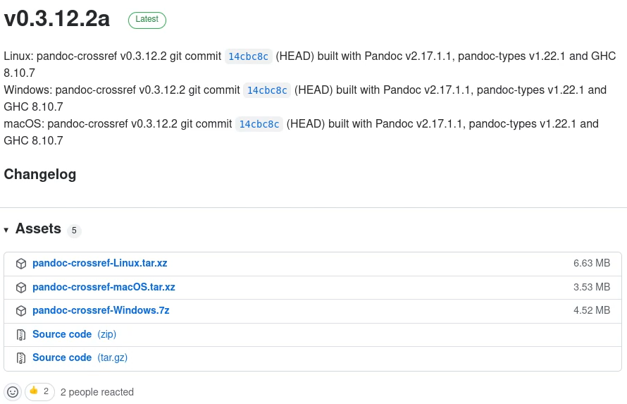
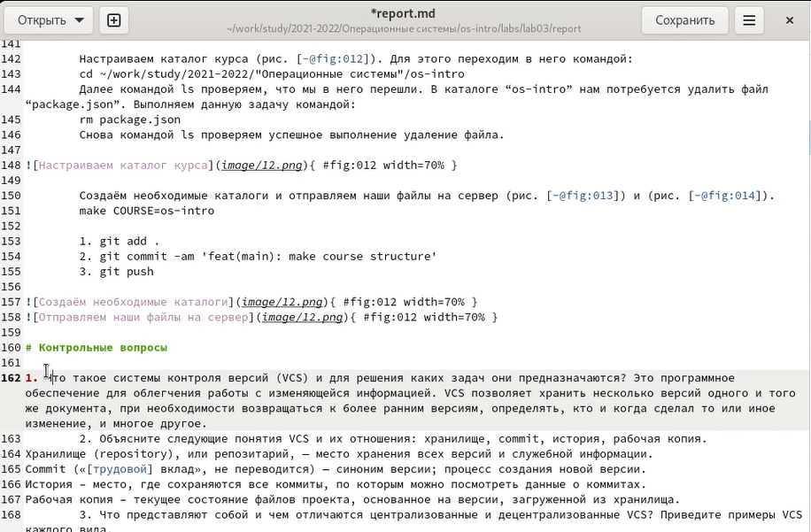
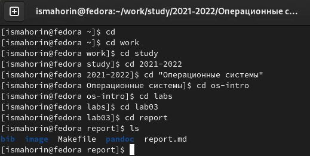
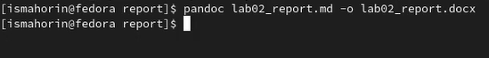
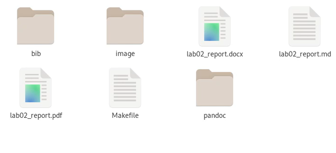

---
## Front matter
lang: ru-RU
title: Лабораторная работа № 3. Markdown.
author: |
	Махорин Иван Сергеевич
institute: |
	RUDN, Москва, Россия
date: 2022, 27 апреля

## Formatting
toc: false
slide_level: 2
theme: metropolis
header-includes: 
 - \metroset{progressbar=frametitle,sectionpage=progressbar,numbering=fraction}
 - '\makeatletter'
 - '\beamer@ignorenonframefalse'
 - '\makeatother'
aspectratio: 43
section-titles: true
---

# Ход работы

## Скачивание pandoc

{ #fig:001 width=70% }

https://github.com/jgm/pandoc/releases
https://github.com/lierdakil/pandoc-crossref/releases

## Установка pandoc

Команды для установки в терминале:

1. sudo dnf install pandoc
2. sudo dnf install texlive-scheme-full
3. cabal v2-update

## Изменение шаблона Markdown

{ #fig:006 width=70% }

## Переход в каталог lab03

{ #fig:007 width=70% }

Основные команды: cd, ls

## Конвертируем в pdf и docx

Команды:

1. pandoc lab02_report.md -o lab02_report.docx
2. pandoc lab02_report.md -o lab02_report.pdf
	
{ #fig:008 width=70% }

## Проверка

{ #fig:009 width=70% }

# Выводы

В ходе выполнения лабораторной работы мы научились оформлять отчёты с помощью легковесного языка Markdown.

## {.standout}

Спасибо за внимание!
