---
## Front matter
title: "Отчёт по лабораторной работе №2"
subtitle: "дисциплина: Операционные системы"
author: "Студент: Махорин Иван Сергеевич"

## Generic otions
lang: ru-RU
toc-title: "Содержание"

## Bibliography
bibliography: bib/cite.bib
csl: pandoc/csl/gost-r-7-0-5-2008-numeric.csl

## Pdf output format
toc: true # Table of contents
toc-depth: 2
lof: true # List of figures
lot: true # List of tables
fontsize: 12pt
linestretch: 1.5
papersize: a4
documentclass: scrreprt
## I18n polyglossia
polyglossia-lang:
  name: russian
  options:
	- spelling=modern
	- babelshorthands=true
polyglossia-otherlangs:
  name: english
## I18n babel
babel-lang: russian
babel-otherlangs: english
## Fonts
mainfont: PT Serif
romanfont: PT Serif
sansfont: PT Sans
monofont: PT Mono
mainfontoptions: Ligatures=TeX
romanfontoptions: Ligatures=TeX
sansfontoptions: Ligatures=TeX,Scale=MatchLowercase
monofontoptions: Scale=MatchLowercase,Scale=0.9
## Biblatex
biblatex: true
biblio-style: "gost-numeric"
biblatexoptions:
  - parentracker=true
  - backend=biber
  - hyperref=auto
  - language=auto
  - autolang=other*
  - citestyle=gost-numeric
## Pandoc-crossref LaTeX customization
figureTitle: "Рис."
tableTitle: "Таблица"
listingTitle: "Листинг"
lofTitle: "Список иллюстраций"
lolTitle: "Листинги"
## Misc options
indent: true
header-includes:
  - \usepackage{indentfirst}
  - \usepackage{float} # keep figures where there are in the text
  - \floatplacement{figure}{H} # keep figures where there are in the text
---

# Цель работы

1. Изучить идеологию и применение средств контроля версий.
2. Освоить умения по работе с git.

# Задание

1. Создать базовую конфигурацию для работы с git.
2. Создать ключ SSH.
3. Создать ключ PGP.
4. Настроить подписи git.
5. Зарегистрироваться на Github.
6. Создать локальный каталог для выполнения заданий по предмету.

# Выполнение лабораторной работы

Произведём настройку github. Для этого создадим учётную запись на https://github.com.
После чего заполняем основные данные в профиле. (рис. [-@fig:001])

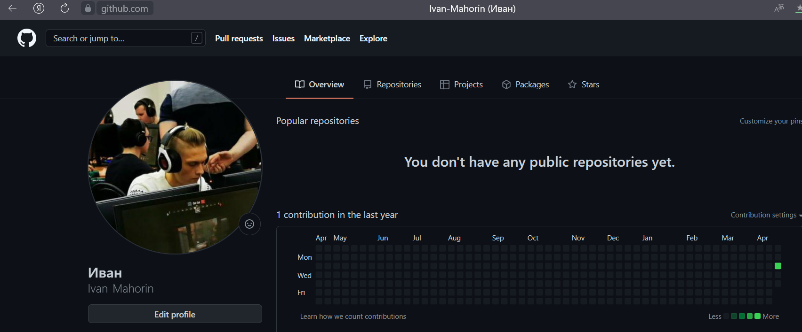{ #fig:001 width=70% }

Следующим шагом устанавливаем git-flow в Fedora Linux, так как это программное обеспечение удалено из репозитория. (рис. [-@fig:002]) и (рис. [-@fig;003]).

Команды для установки:

1. cd /tmp 

wget --no-check-certificate -q https://raw.github.com/petervanderdoes /gitflow/develop/contrib/gitflow-installer.sh

2. chmod +x gitflow-installer.sh
3. sudo ./gitflow-installer.sh install stable 

{ #fig:002 width=70% }

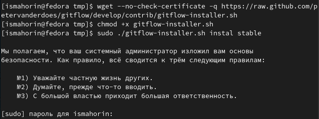{ #fig:003 width=70% }

Базовая настройка git (рис. [-@fig:004]):

1. Задаём имя и email владельца репозитория (1 и 2 строка на рисунке)
2. Настраиваем utf-8 в выводе сообщений git (3 строка на рисунке)
3. Настраиваем верификацию и подписание коммитов git. Зададим имя начальной ветки (будем называть её master) (4 строка на рисунке)
4. Параметр autocrlf (5 строка на рисунке)
5. Параметр safecrlf (6 строка на рисунке)
    	   	
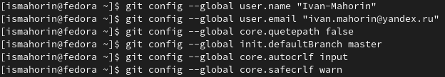{ #fig:004 width=70% }

Создаём ключ SSH (рис. [-@fig:005]). В терминале вводим данную команду:

ssh-keygen -t rsa -b 4096

Далее во всех пунктах пользуемся клавишей Enter и получаем наш ключ.
	
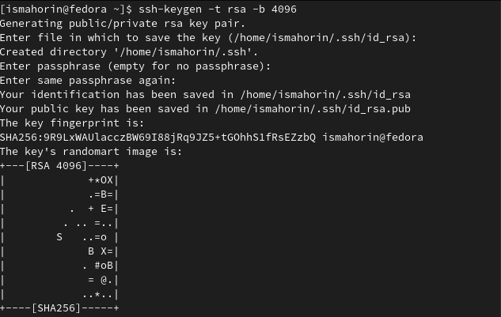{ #fig:005 width=70% }

Чтобы можно было скопировать наш ключ и добавить его на github, потребуется команда:

cat ~/ .ssh/id_rsa/pub (рис. [-@fig:006]).
	
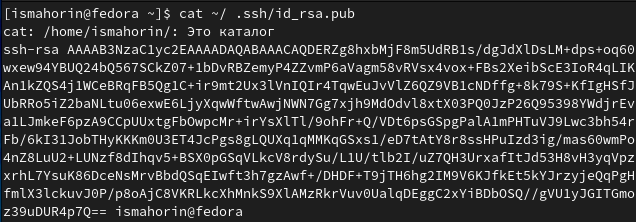{ #fig:006 width=70% }

Скопированный ключ нужно добавить на github. Для этого переходим на сайте в раздел “Settings” и выбираем “SSH and GPG keys” (рис. [-@fig:007]). Как только мы выбрали SHH keys, даём название нашему ключу и копируем ключ из терминала. 

В моём случае был создан ключ под названием OS (операционные системы) (рис. [-@fig:008]).

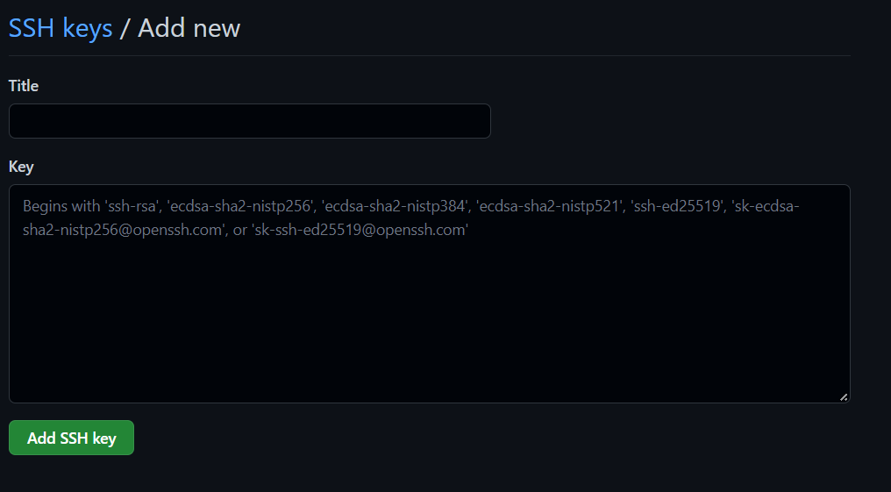{ #fig:007 width=70% }

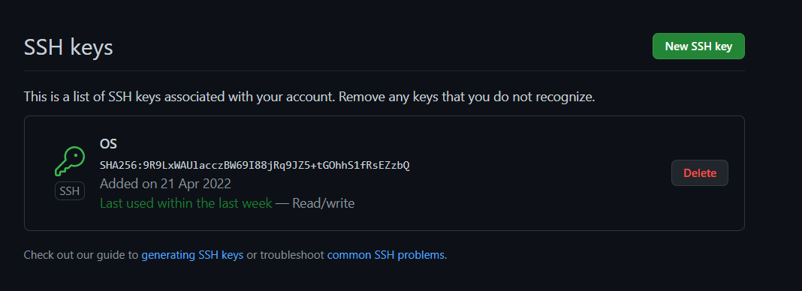{ #fig:008 width=70% }

Возвращаемся в наш терминал и настраиваем gh командой:

gh auth login (рис. [-@fig:009]).

Во всех пунктах выбираем y(yes).

По полученной ссылке переходим в браузер на виртуальной машине и вводим код из терминала (находится перед ссылкой).

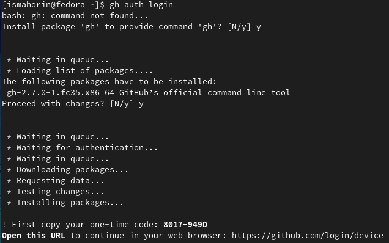{ #fig:009 width=70% }

Создаём репозиторий курса на основе шаблона (рис. [-@fig:010]) и (рис. [-@fig:011]). Все нужные команды для создания были в указаниях к лабораторной работе. В 4 команде, вместо <владелец>, указываем своё имя профиля на github.
	
1. mkdir -p ~/work/study/2021-2022/"Операционные системы" 
2. cd ~/work/study/2021-2022/"Операционные системы" 
3. gh repo create study_2021-2022_os-intro --template=yamadharma/course-directory-student-template --public 
4. git clone --recursive git@github.com:<владелец>/study_2021-2022_os-intro.git os-intro
    	
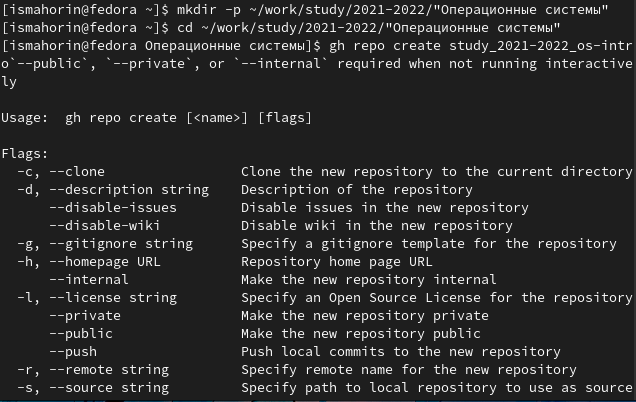{ #fig:010 width=70% }

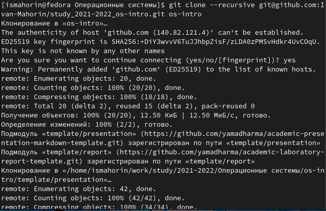{ #fig:011 width=70% }

Настраиваем каталог курса (рис. [-@fig:012]). Для этого переходим в него командой:

cd ~/work/study/2021-2022/"Операционные системы"/os-intro

Далее командой ls проверяем, что мы в него перешли. В каталоге “os-intro” нам потребуется удалить файл “package.json”. Выполняем данную задачу командой: 

rm package.json

Снова командой ls проверяем успешное выполнение удаление файла.

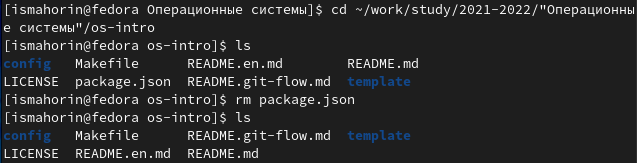{ #fig:012 width=70% }

Создаём необходимые каталоги и отправляем наши файлы на сервер (рис. [-@fig:013]) и (рис. [-@fig:014]).
	
make COURSE=os-intro

1. git add . 
2. git commit -am 'feat(main): make course structure' 
3. git push
    	
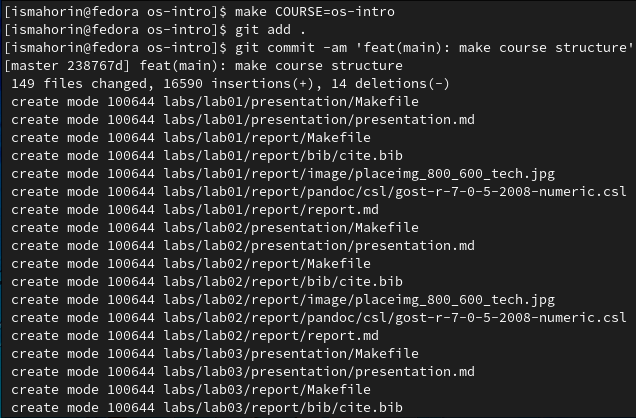{ #fig:013 width=70% }

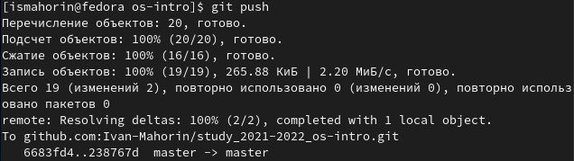{ #fig:014 width=70% }

# Контрольные вопросы

1. Что такое системы контроля версий (VCS) и для решения каких задач они предназначаются? Это программное обеспечение для облегчения работы с изменяющейся информацией. VCS позволяет хранить несколько версий одного и того же документа, при необходимости возвращаться к более ранним версиям, определять, кто и когда сделал то или иное изменение, и многое другое.
2. Объясните следующие понятия VCS и их отношения: хранилище, commit, история, рабочая копия. 
Хранилище (repository), или репозитарий, — место хранения всех версий и служебной информации. 
Commit («[трудовой] вклад», не переводится) — синоним версии; процесс создания новой версии.
История – место, где сохраняются все коммиты, по которым можно посмотреть данные о коммитах.
Рабочая копия – текущее состояние файлов проекта, основанное на версии, загруженной из хранилища.
3. Что представляют собой и чем отличаются централизованные и децентрализованные VCS? Приведите примеры VCS каждого вида.
Централизованные VCS: одно основное хранилище всего проекта и каждый пользователь копирует себе необходимые ему файлы из этого репозитория, изменяет и, затем, добавляет свои изменения обратно. 
Децентрализованные VCS:
у каждого пользователя свой вариант (возможно не один) репозитория.
4. Опишите действия с VCS при единоличной работе с хранилищем. 
5. Опишите порядок работы с общим хранилищем VCS. 
6. Каковы основные задачи, решаемые инструментальным средством git? 
Git — это система управления версиями. У Git две основных задачи: первая — хранить информацию о всех изменениях в вашем коде, начиная с самой первой строчки, а вторая — обеспечение удобства командной работы над кодом.
7. Назовите и дайте краткую характеристику командам git. 
git –version (Проверка версии Git)
git init (Инициализировать ваш текущий рабочий каталог как Git-репозиторий)
git clone https://www.github.com/username/repo-name (Скопировать существующий удаленный Git-репозиторий)
git remote (Просмотреть список текущих удалённых репозиториев Git)
git remote -v (Для более подробного вывода)
git add my_script.py (Можете указать в команде конкретный файл).
git add . (Позволяет охватить все файлы в текущем каталоге, включая файлы, чье имя начинается с точки)
git commit -am "Commit message" (Вы можете сжать все индексированные файлы и отправить коммит).
git branch (Просмотреть список текущих веток можно с помощью команды branch)
git –help (Чтобы узнать больше обо всех доступных параметрах и командах)
git push origin master (Передать локальные коммиты в ветку удаленного репозитория).
8. Приведите примеры использования при работе с локальным и удалённым репозиториями. 
9. Что такое и зачем могут быть нужны ветви (branches)? 
Ветки нужны, чтобы несколько программистов могли вести работу над одним и тем же проектом или даже файлом одновременно, при этом не мешая друг другу. Кроме того, ветки используются для тестирования экспериментальных функций: чтобы не повредить основному проекту, создается новая ветка специально для экспериментов.
10. Как и зачем можно игнорировать некоторые файлы при commit?
Игнорируемые файлы — это, как правило, артефакты сборки и файлы, генерируемые машиной из исходных файлов в вашем репозитории, либо файлы, которые по какой-либо иной причине не должны попадать в коммиты.

# Выводы

В ходе выполнения лабораторной работы изучили идеологию и применение средств контроля версий, а также освоили умения по работе с git.

