---
## Front matter
lang: ru-RU
title: Лабораторная работа № 4.
author: |
	Махорин Иван Сергеевич
institute: |
	RUDN, Москва, Россия
date: 2022, 28 апреля

## Formatting
toc: false
slide_level: 2
theme: metropolis
header-includes: 
 - \metroset{progressbar=frametitle,sectionpage=progressbar,numbering=fraction}
 - '\makeatletter'
 - '\beamer@ignorenonframefalse'
 - '\makeatother'
aspectratio: 43
section-titles: true
---

# Основы интерфейса взаимодействия пользователя с системой Unix на уровне командной строки

## Команда pwd

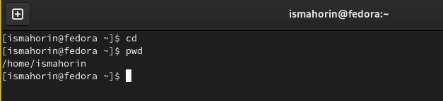{ #fig:001 width=70% }

Определение полного имени домашнего каталога с помощью команды pwd.

## Работа с каталогом /tmp

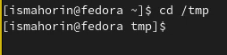{ #fig:002 width=70% }

## Команда ls

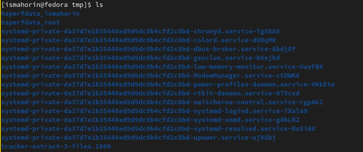{ #fig:003 width=70% }

Команда ls используется для просмотра содержимого каталога.

## Команда ls -a

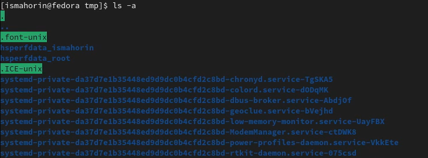{ #fig:004 width=70% }

Команда ls -a используется для отображения имён скрытых файлов.

## Команда ls -l

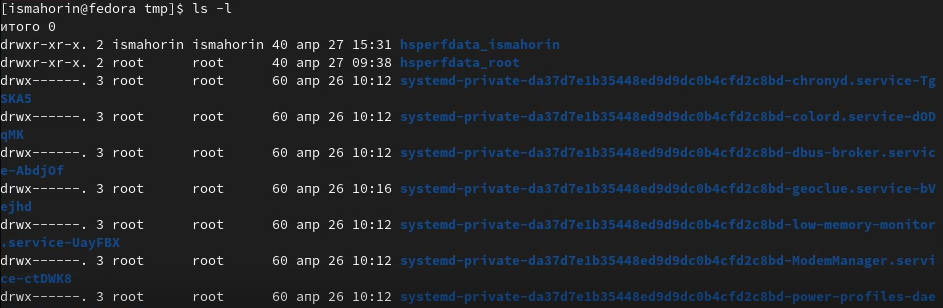{ #fig:005 width=100% }

Команда ls -l используется для вывода на экран подробной информации о файлах и каталогах.

## Команда ls -F

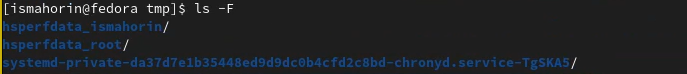{ #fig:006 width=70% }

Команда ls -F используется для получения информации о типах файлов (каталог, исполняемый файл, ссылка).

## Команда ls -alF

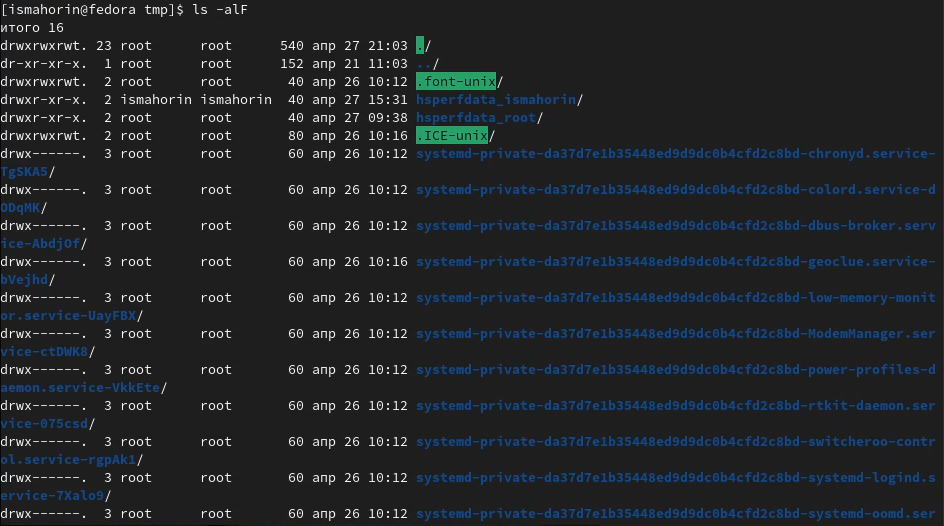{ #fig:007 width=100% }

## Поиск подкаталога с именем cron

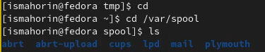{ #fig:008 width=70% }

## Вывод содержимого домашнего каталога

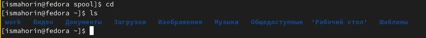{ #fig:009 width=100% }

## Создание нового каталога newdir

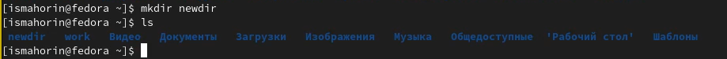{ #fig:010 width=100% }

## Создание подкаталога morefun

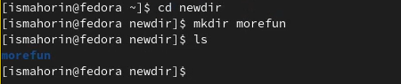{ #fig:011 width=70% }

## Создание и удаление трёх каталогов сразу

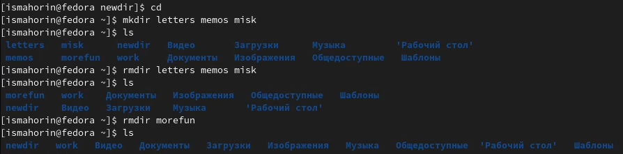{ #fig:012 width=100% }

## Попытка удаления каталога newdir

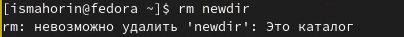{ #fig:013 width=70% }

## Удаление каталога newdir и подкаталога morefun из домашнего каталога

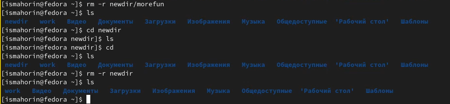{ #fig:014 width=100% }

## Команда man ls

{ #fig:015 width=100% }

Опция -R - просмотр содержимого не только указанного каталога, но и подкаталогов.

## Команда man ls

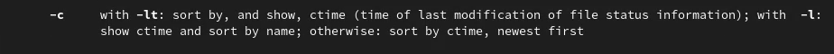{ #fig:016 width=100% }

-c -lt - набор опций команды, позволяющий отсортировать по времени последнего изменения выводимый список содержимого каталога.

# Описание команд

## Команда cd 

Команда cd используется для перемещения по файловой системе операционной системы типа Linux.

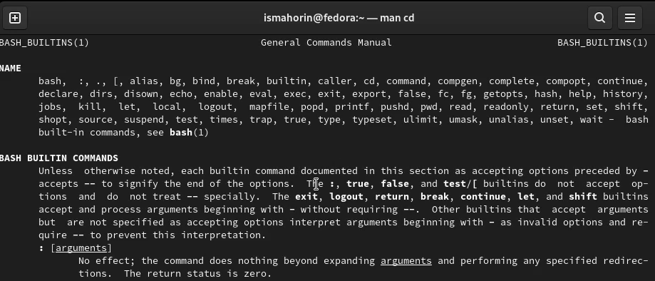{ #fig:017 width=100% }

## Команда pwd

Для определения абсолютного пути к текущему каталогу используется команда pwd (print working directory).

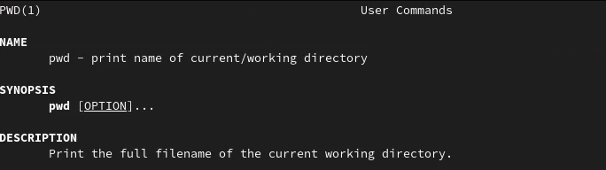{ #fig:018 width=100% }

## Команда mkdir

Команда mkdir используется для создания каталогов.

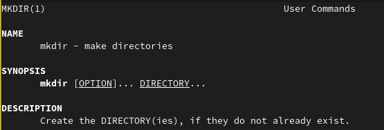{ #fig:019 width=100% }

## Команда rmdir

Команда rmdir используется для удаления пустых каталогов. 

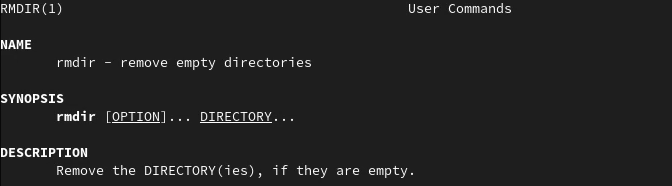{ #fig:020 width=100% }

## Команда rm

Команда rm используется для удаления файлов и/или каталогов.

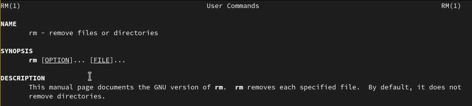{ #fig:021 width=100% }

## История команд (history)

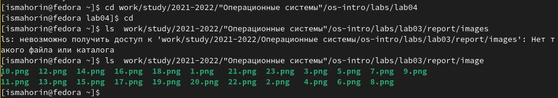{ #fig:022 width=100% }

# Выводы

В ходе выполнения лабораторной работы были приобретены практические навыки взаимодействия пользователя с системой посредством командной строки.

## {.standout}

Спасибо за внимание!
