---
## Front matter
title: "Отчёт по лабораторной работе №4"
subtitle: "дисциплина: Операционные системы"
author: "Студент: Махорин Иван Сергеевич"

## Generic otions
lang: ru-RU
toc-title: "Содержание"

## Bibliography
bibliography: bib/cite.bib
csl: pandoc/csl/gost-r-7-0-5-2008-numeric.csl

## Pdf output format
toc: true # Table of contents
toc-depth: 2
lof: true # List of figures
lot: true # List of tables
fontsize: 12pt
linestretch: 1.5
papersize: a4
documentclass: scrreprt
## I18n polyglossia
polyglossia-lang:
  name: russian
  options:
	- spelling=modern
	- babelshorthands=true
polyglossia-otherlangs:
  name: english
## I18n babel
babel-lang: russian
babel-otherlangs: english
## Fonts
mainfont: PT Serif
romanfont: PT Serif
sansfont: PT Sans
monofont: PT Mono
mainfontoptions: Ligatures=TeX
romanfontoptions: Ligatures=TeX
sansfontoptions: Ligatures=TeX,Scale=MatchLowercase
monofontoptions: Scale=MatchLowercase,Scale=0.9
## Biblatex
biblatex: true
biblio-style: "gost-numeric"
biblatexoptions:
  - parentracker=true
  - backend=biber
  - hyperref=auto
  - language=auto
  - autolang=other*
  - citestyle=gost-numeric
## Pandoc-crossref LaTeX customization
figureTitle: "Рис."
tableTitle: "Таблица"
listingTitle: "Листинг"
lofTitle: "Список иллюстраций"
lolTitle: "Листинги"
## Misc options
indent: true
header-includes:
  - \usepackage{indentfirst}
  - \usepackage{float} # keep figures where there are in the text
  - \floatplacement{figure}{H} # keep figures where there are in the text
---

# Цель работы

Приобретение практических навыков взаимодействия пользователя с системой посредством командной строки.

# Задание

1. Определите полное имя вашего домашнего каталога. Далее относительно этого каталога будут выполняться последующие упражнения.
2. Выполните следующие действия:
- Перейдите в каталог /tmp.
- Выведите на экран содержимое каталога /tmp. Для этого используйте команду ls
с различными опциями. Поясните разницу в выводимой на экран информации.
- Определите, есть ли в каталоге /var/spool подкаталог с именем cron?
- Перейдите в Ваш домашний каталог и выведите на экран его содержимое. Определите, кто является владельцем файлов и подкаталогов?
3. Выполните следующие действия:
- В домашнем каталоге создайте новый каталог с именем newdir.
- В каталоге ~/newdir создайте новый каталог с именем morefun.
- В домашнем каталоге создайте одной командой три новых каталога с именами letters, memos, misk. Затем удалите эти каталоги одной командой.
- Попробуйте удалить ранее созданный каталог ~/newdir командой rm. Проверьте, был ли каталог удалён.
- Удалите каталог ~/newdir/morefun из домашнего каталога. Проверьте, был ли каталог удалён.
4. С помощью команды man определите, какую опцию команды ls нужно использовать для просмотра содержимое не только указанного каталога, но и подкаталогов, входящих в него.
5. С помощью команды man определите набор опций команды ls, позволяющий отсортировать по времени последнего изменения выводимый список содержимого каталога с развёрнутым описанием файлов.
6. Используйте команду man для просмотра описания следующих команд: cd, pwd, mkdir, rmdir, rm. Поясните основные опции этих команд.
7. Используя информацию, полученную при помощи команды history, выполните модификацию и исполнение нескольких команд из буфера команд.

# Выполнение лабораторной работы

Определим полное имя домашнего каталога с помощью команды pwd (рис. [-@fig:001]).

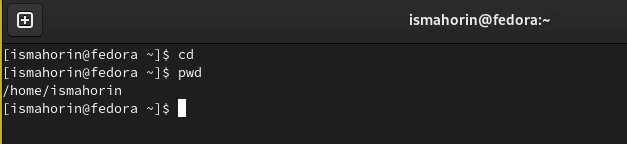{ #fig:001 width=70% }

Следующим шагом перейдём в каталог /tmp с помощью команды cd (рис. [-@fig:002]).

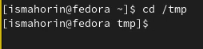{ #fig:002 width=70% }

Выводим на экран содержимое каталога /tmp с помощью команды ls с различными опциями.

Команда ls используется для просмотра содержимого каталога (рис. [-@fig:003]).

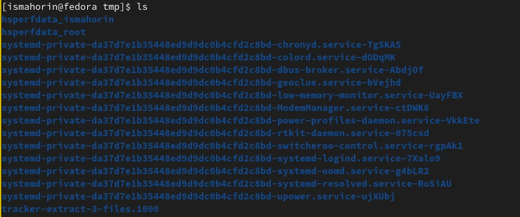{ #fig:003 width=70% }

Для того, чтобы отобразить имена скрытых файлов, необходимо использовать команду ls с опцией a рис. [-@fig:004]).

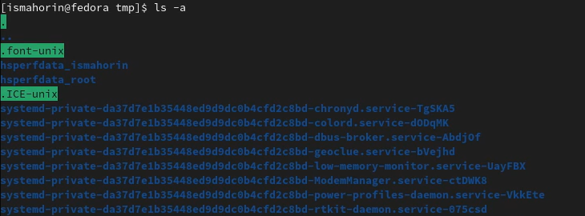{ #fig:004 width=70% }

Чтобы вывести на экран подробную информацию о файлах и каталогах, необходимо использовать опцию l (рис. [-@fig:005]).

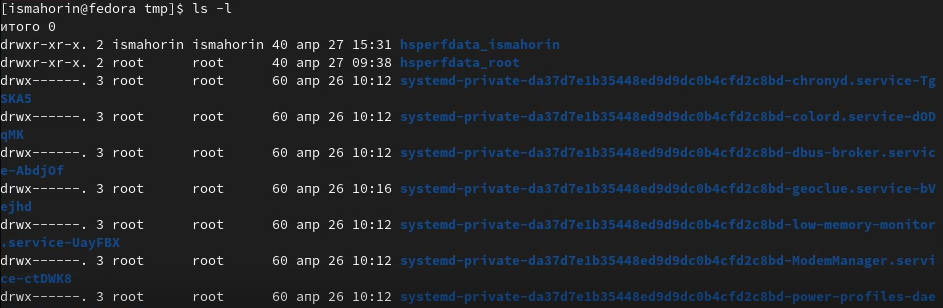{ #fig:005 width=100% }

Можно также получить информацию о типах файлов (каталог, исполняемый файл, ссылка), для чего используется опция F (рис. [-@fig:006]).

{ #fig:006 width=70% }

Оптимизированная команда ls с различными опциями (рис. [-@fig:007]).

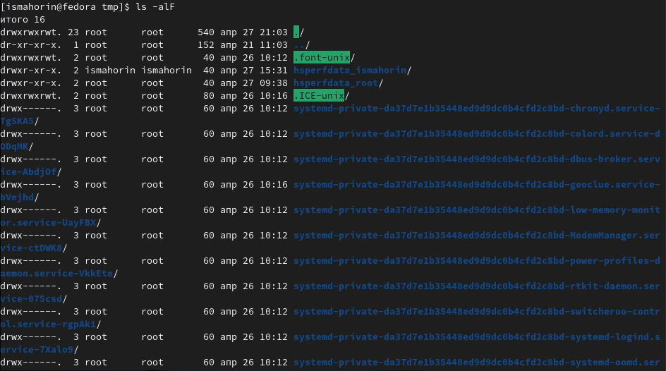{ #fig:007 width=100% }

Определяем, есть ли в каталоге /var/spool подкаталог с именем cron. Для этого вернёмся в домашний каталог и с помощью команд сd и ls проверим это (рис. [-@fig:008]).
	
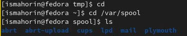{ #fig:008 width=70% }

Далее переходим в наш домашний каталог с помощью команды cd и выводим его содержимое (рис. [-@fig:009]).

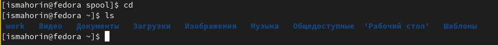{ #fig:009 width=100% }

В домашнем каталоге создаём новый каталог с именем newdir с помощью команды mkdir и проверяем выполнение данной команды (рис. [-@fig:010]). 

{ #fig:010 width=100% }

В каталоге newdir создаём новый каталог с именем morefun (рис. [-@fig:011]).

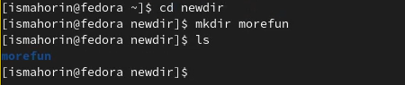{ #fig:011 width=70% }

Одной командой создаём три новых каталога с именами letters, memos, misk. Затем одной командой rmdir удаляем их (рис. [-@fig:012]). 
    	
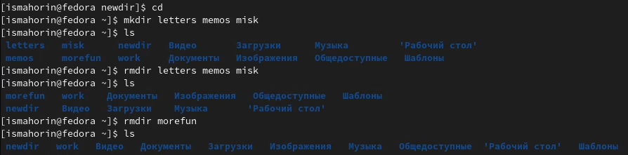{ #fig:012 width=100% }

Попробуем удалить ранее созданный каталог newdir командой rm. Мы видим, что это невозможно (рис. [-@fig:013]). 

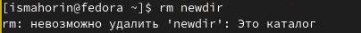{ #fig:013 width=70% }

Удаляем каталог newdir и подкаталог morefun из домашнего каталога, после чего выполняем проверку командой ls. (рис. [-@fig:014]).

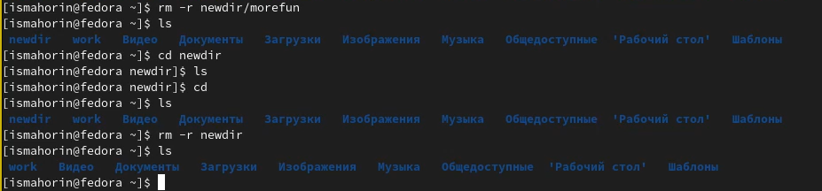{ #fig:014 width=100% }

С помощью команды man ls выясняем, что для просмотра содержимого не только указанного каталога, но и подкаталогов нужно использовать опцию -R (рис. [-@fig:015]).

{ #fig:015 width=100% }

С помощью команды man ls определяем набор опций команды, позволяющий отсортировать по времени последнего изменения выводимый список содержимого каталога. Таким набором опций являются: -c -lt (рис. [-@fig:016]).

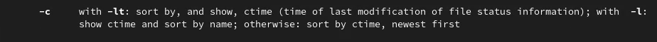{ #fig:016 width=100% }

Используем команду man для просмотра описания команд: cd, pwd, mkdir, rmdir, rm.

Команда cd используется для перемещения по файловой системе операционной системы типа Linux (рис. [-@fig:017]).

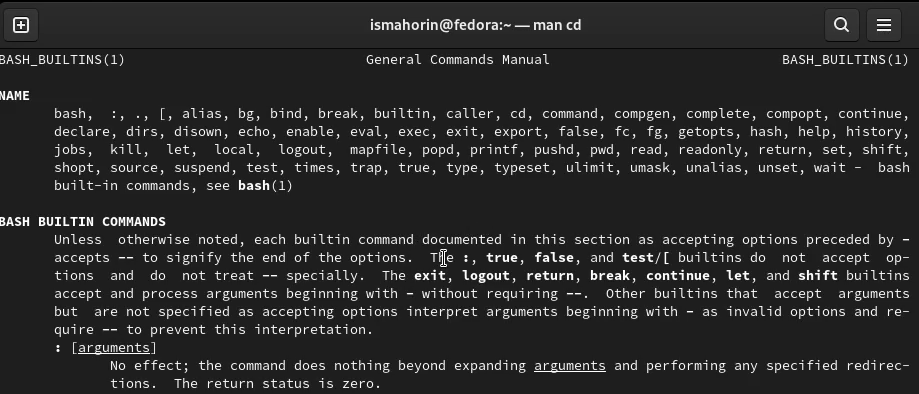{ #fig:017 width=100% }

Для определения абсолютного пути к текущему каталогу используется команда pwd (print working directory) (рис. [-@fig:018]).

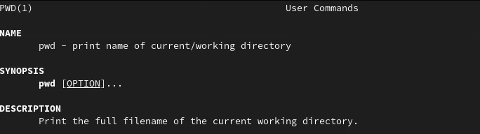{ #fig:018 width=100% }

Команда mkdir используется для создания каталогов (рис. [-@fig:019]).

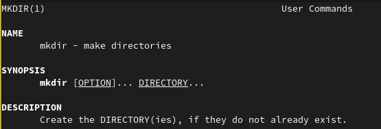{ #fig:019 width=100% }

Команда rmdir используется для удаления пустых каталогов (рис. [-@fig:020]).

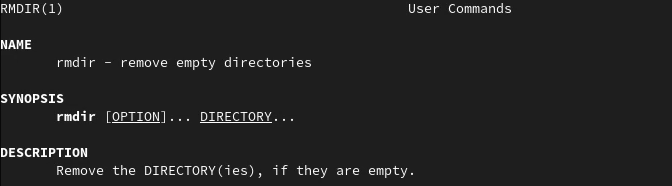{ #fig:020 width=100% }

Команда rm используется для удаления файлов и/или каталогов (рис. [-@fig:021]).

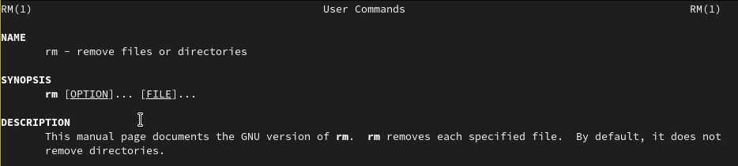{ #fig:021 width=100% }

Используя информацию, полученную при помощи команды history, выполняем модификацию команд cd и ls, после чего исполняем их (рис. [-@fig:022]).

{ #fig:021 width=100% }

# Контрольные вопросы

1. Что такое командная строка? Терминал Linux предоставляет интерфейс, в котором можно вводить команды и видеть результат, напечатанный в виде текста. Можно использовать терминал для выполнения таких задач, как перемещение файлов или навигация по каталогу, без использования графического интерфейса.
2. При помощи какой команды можно определить абсолютный путь текущего каталога? Приведите пример. При помощи команды pwd. 
3. При помощи какой команды и каких опций можно определить только тип файлов и их имена в текущем каталоге? Приведите примеры. ls -F.
4. Каким образом отобразить информацию о скрытых файлах? Приведите примеры. Для того, чтобы отобразить имена скрытых файлов, необходимо использовать команду ls с опцией a.
5. При помощи каких команд можно удалить файл и каталог? Можно ли это сделать одной и той же командой? Приведите примеры. rmdir и rm.
6. Каким образом можно вывести информацию о последних выполненных пользователем командах? работы?
7. Как воспользоваться историей команд для их модифицированного выполнения? Приведите примеры. С помощью команды history.
8. Приведите примеры запуска нескольких команд в одной строке. 
9. Дайте определение и приведите примера символов экранирования. Экранирование символов — замена в тексте управляющих символов на соответствующие текстовые подстановки.
10. Охарактеризуйте вывод информации на экран после выполнения команды ls с опцией l. Чтобы вывести на экран подробную информацию о файлах и каталогах, необходимо использовать опцию l. При этом о каждом файле и каталоге будет выведена следующая информация: тип файла, право доступа, число ссылок, владелец, размер, дата последней ревизии, имя файла или каталога.
11. Что такое относительный путь к файлу? Приведите примеры использования относительного и абсолютного пути при выполнении какой-либо команды. Относительный путь представляет собой путь по отношению к текущему рабочему каталогу пользователя или активных приложений. 
12. Как получить информацию об интересующей вас команде? При помощи команды man.
13. Какая клавиша или комбинация клавиш служит для автоматического дополнения вводимых команд? Tab.

# Выводы

В ходе выполнения лабораторной работы были приобретены практические навыки взаимодействия пользователя с системой посредством командной строки.

