---
## Front matter
lang: ru-RU
title: Лабораторная работа № 9.
author: |
	Махорин Иван Сергеевич
institute: |
	RUDN, Москва, Россия
date: 2022, 15 мая

## Formatting
toc: false
slide_level: 2
theme: metropolis
header-includes: 
 - \metroset{progressbar=frametitle,sectionpage=progressbar,numbering=fraction}
 - '\makeatletter'
 - '\beamer@ignorenonframefalse'
 - '\makeatother'
aspectratio: 43
section-titles: true
---

# Текстовой редактор emacs

## Открытие emacs и создание файла 

Ctrl-x Ctrl-f - создание файла.

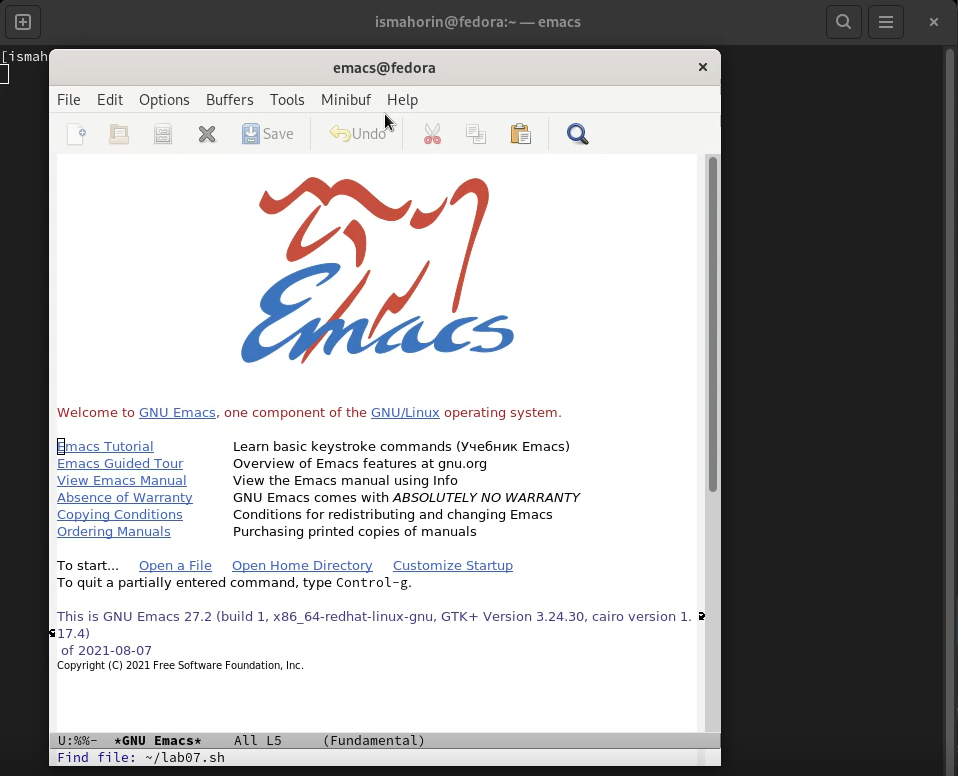{ #fig:001 width=70% }

## Набор текста и сохранение файла

Ctrl-x Ctrl-s - сохранение файла.

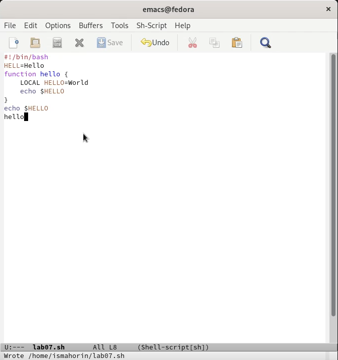{ #fig:002 width=55% }

## Выполнение стандартных процедур редактирования

1. Ctrl-k - вырезать целую строку.
2. Ctrl-y - вставить строку в конец файла. 
3. Ctrl-space - выделить область текста.
4. Alt-w - копировать в буфер обмена 
5. Ctrl-y - вставить область в конец файла.
6. Ctrl-space - выделить область текста. 
7. Ctrl-w - вырезать область текста.
8. Ctrl-/ - отменить последнее действие.

## Выполнение стандартных процедур редактирования

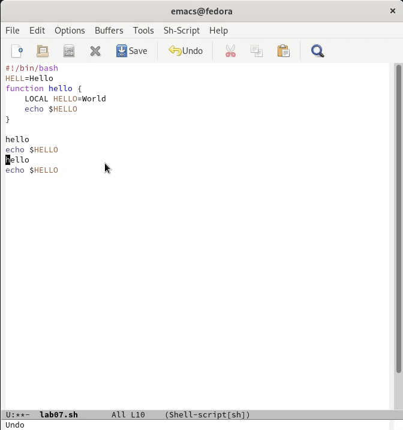{ #fig:003 width=60% }

## Команды по перемещению

1. Перемещения курсора в начало строки Ctrl-a, в конец строки Ctrl-e. 
2. Перемещение курсора в начало буфера Alt-<, в конец буфера Alt->.

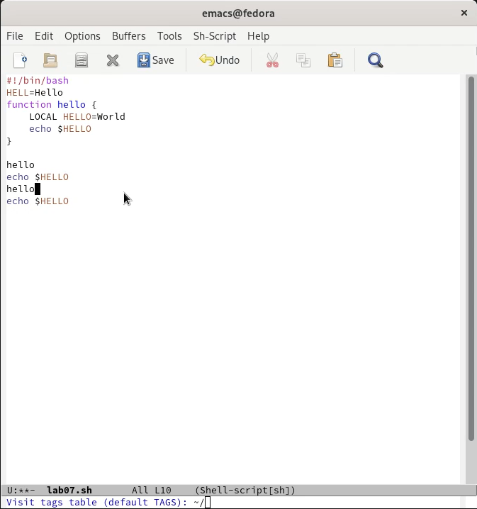{ #fig:004 width=40% }

## Управление буферами

1. Ctrl-x Ctrl-b - вывести список активных буферов на экран.
2. Ctrl-x - переместиться во вновь открытое окно.
3. Ctrl-x 0 - закрыть это окно.

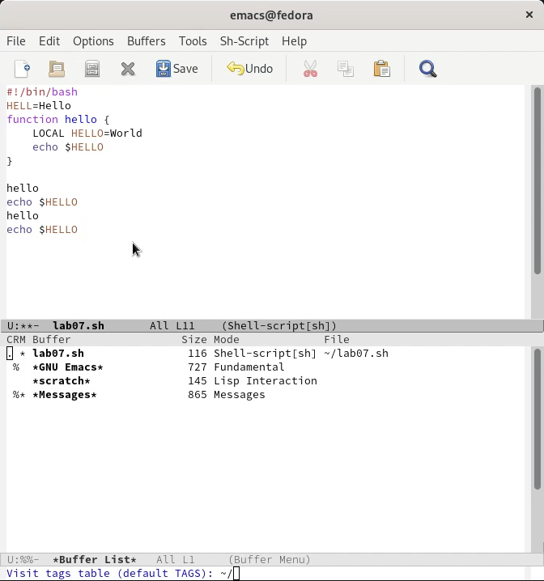{ #fig:005 width=40% }

## Управление окнами

1. Ctrl-x 3 - разделить фрейм на два окна по вертикали.
2. Ctrl-x 2 - разделить каждое из этих окон на две части по горизонтали.

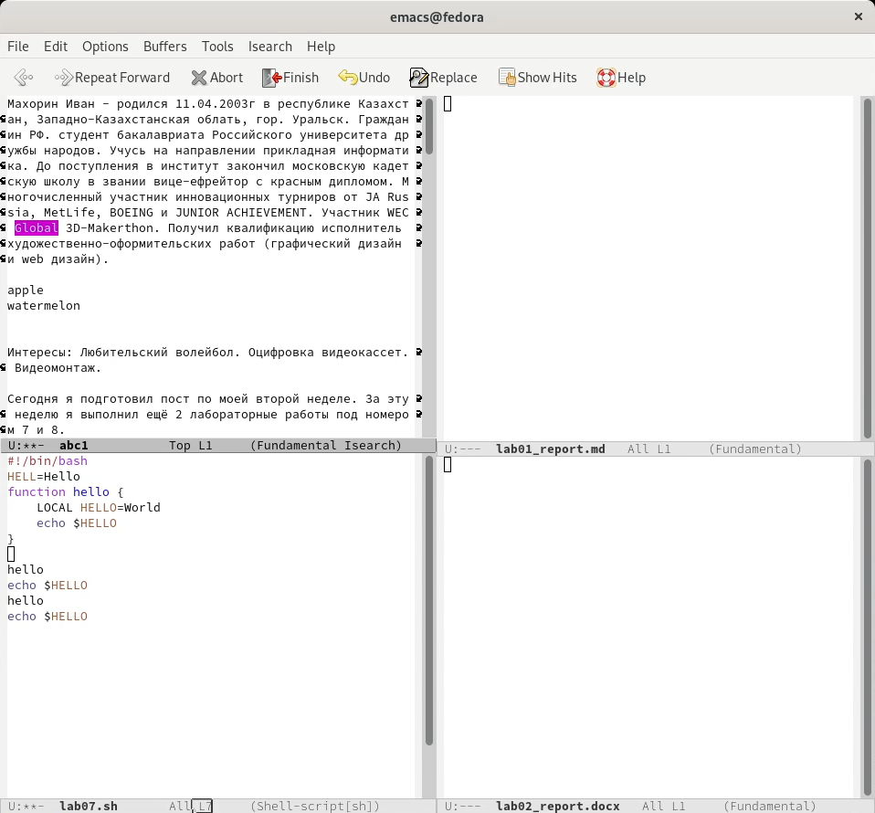{ #fig:006 width=40% }

## Работа с режимом поиска

1. Ctrl-s - переключиться в режим поиска и также для переключения между результатами поиска. 
2. Ctrl-g - выйти из режима поиска.

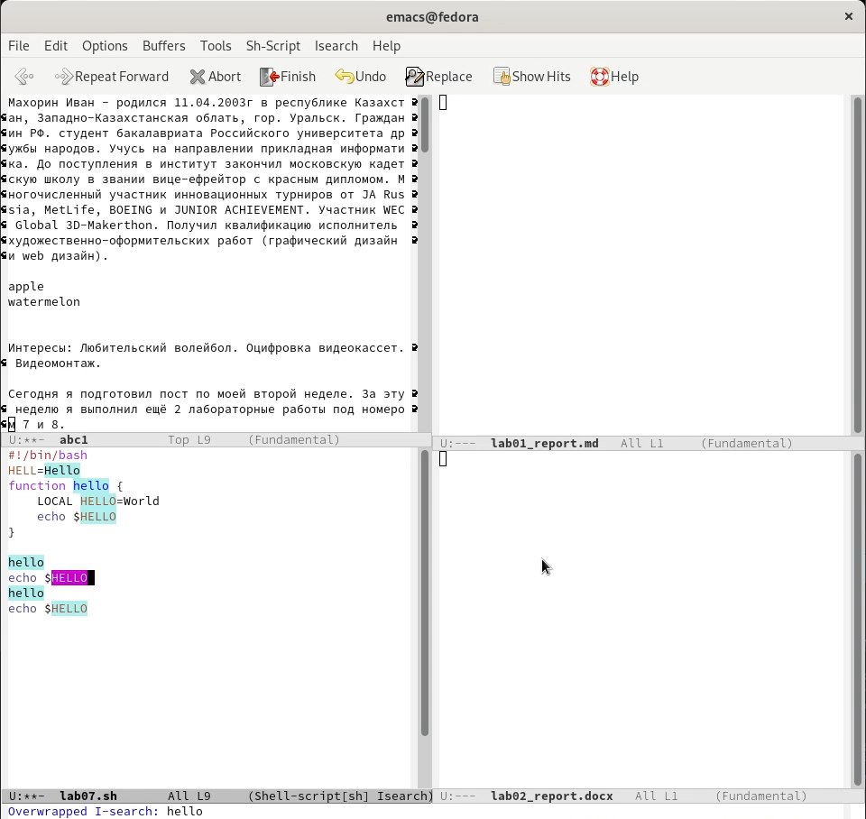{ #fig:007 width=40% }

## Режим поиска и замены
	
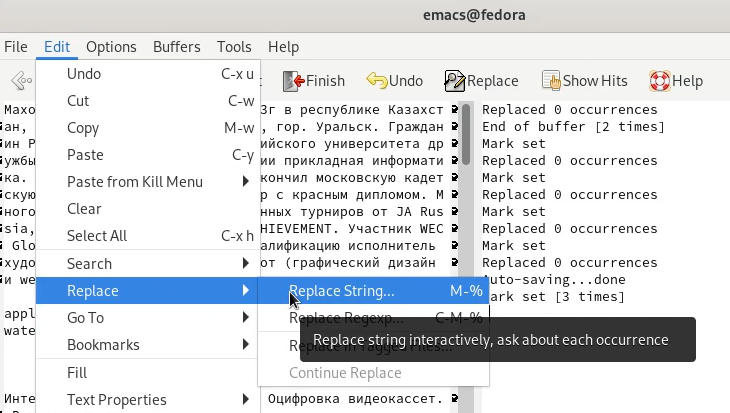{ #fig:008 width=100% }

## Работа с режимом поиска и замены

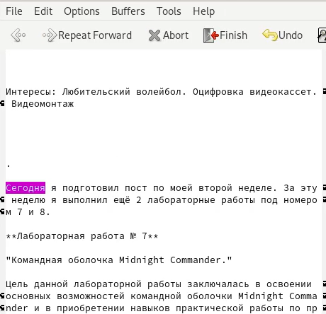{ #fig:009 width=60% }

## Работа с режимом поиска и замены

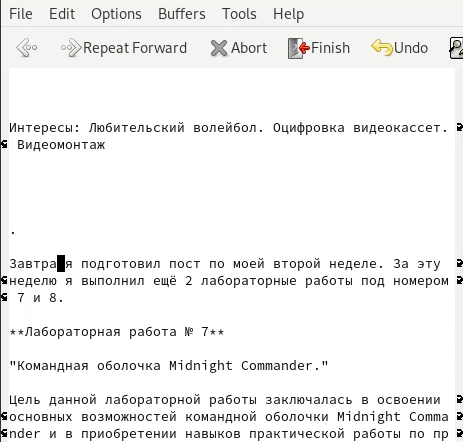{ #fig:010 width=60% }

## Альтернативный режим поиска

Alt-s o - альтернативный режим поиска.

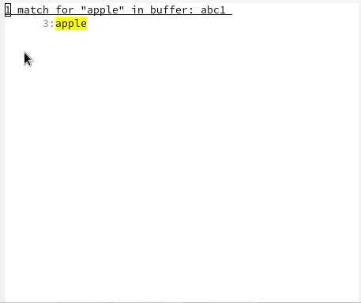{ #fig:011 width=60% }

# Выводы

В ходе выполнения лабораторной работы мы познакомились с операционной системой Linux и получили практические навыки работы с редактором Emacs.

## {.standout}

Спасибо за внимание!
