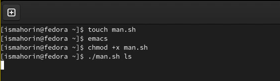

---
## Front matter
lang: ru-RU
title: Лабораторная работа № 12.
author: |
	Махорин Иван Сергеевич
institute: |
	RUDN, Москва, Россия
date: 2022, 26 мая

## Formatting
toc: false
slide_level: 2
theme: metropolis
header-includes: 
 - \metroset{progressbar=frametitle,sectionpage=progressbar,numbering=fraction}
 - '\makeatletter'
 - '\beamer@ignorenonframefalse'
 - '\makeatother'
aspectratio: 43
section-titles: true
---

# Программирование в командном процессоре ОС UNIX. Расширенное программирование.

## Создание первого файла для скрипта

{ #fig:001 width=100% }

## Написание первого скрипта

Написать командный файл, который реализует упрощённый механизм семафоров. Командный файл должен в течение некоторого времени t1 дожидаться освобождения ресурса, выдавая об этом сообщение, а дождавшись его освобождения, использовать его в течение некоторого времени t2<>t1, также выдавая информацию о том, что ресурс используется соответствующим командным файлом (процессом). Запустить командный файл в одном виртуальном терминале в фоновом режиме, перенаправив его вывод в другой (> /dev/tty#, где # — номер терминала куда перенаправляется вывод), в котором также запущен этот файл, но не фоновом, а в привилегированном режиме.

## Написание первого скрипта

{ #fig:002 width=50% }

## Запуск файла

{ #fig:003 width=100% }

## Доработка

Доработаем программу так, чтобы имелась возможность взаимодействия трёх и более процессов.

## Доработка

{ #fig:004 width=50% }

## Сохранение и проверка

{ #fig:005 width=100% }

## Создание второго файла

{ #fig:006 width=100% }

## Написание второго скрипта

Приступиить к реализации команды man с помощью командного файла. Изучить содержимое каталога /usr/share/man/man1. В нем находятся архивы текстовых файлов, содержащих справку по большинству установленных в системе программ и команд. Каждый архив можно открыть командой less сразу же просмотрев содержимое справки. Командный файл должен получать в виде аргумента командной строки название команды и в виде результата выдавать справку об этой команде или сообщение об отсутствии справки, если соответствующего файла нет в каталоге man1.

## Написание второго скрипта

{ #fig:007 width=100% }

## Право на выполнение и запуск файла

{ #fig:008 width=100% }

## Информация

{ #fig:009 width=100% }

## Создание третьего файла 

{ #fig:010 width=100% }

## Написание третьего скрипта

Написать командный файл, генерирующий случайную последовательность букв латинского алфавита. Учесть, что $RANDOM выдаёт псевдослучайные числа в диапазоне от 0 до 32767. 

## Написание третьего скрипта
	
{ #fig:011 width=100% }

## Сохранение и право на выполнение

{ #fig:012 width=100% }

# Выводы

В ходе выполнения лабораторной работы мы изучили основы программирования в оболочке ОС UNIX и научились писать более сложные командные файлы с использованием логических управляющих конструкций и циклов.

## {.standout}

Спасибо за внимание!
