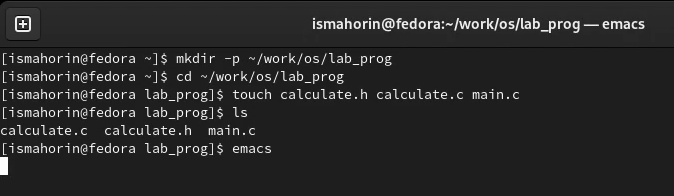
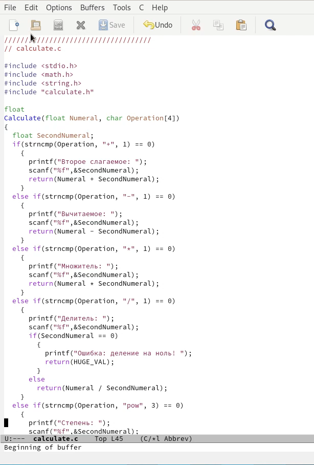
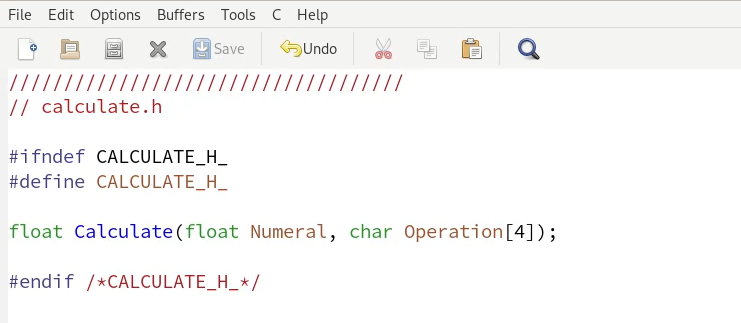
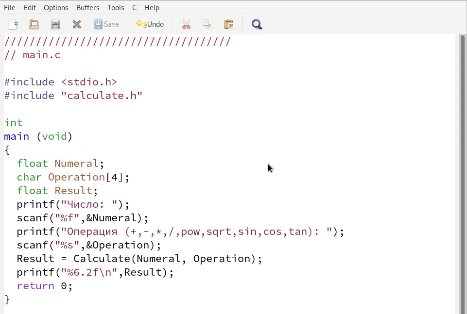
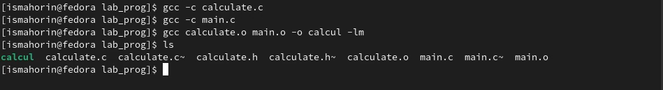
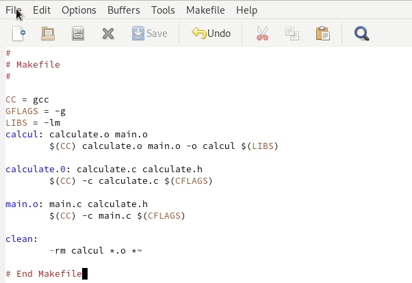
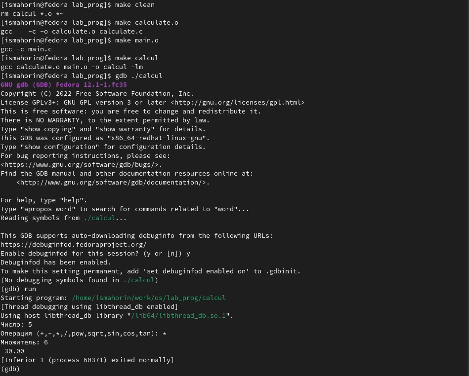
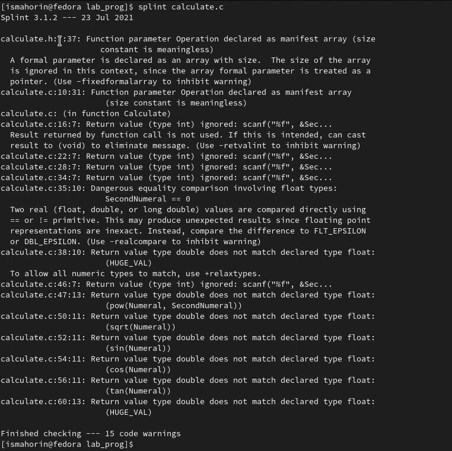
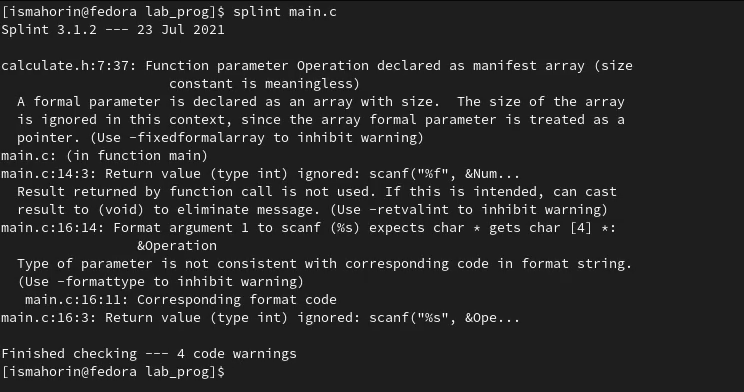

---
## Front matter
lang: ru-RU
title: Лабораторная работа № 13.
author: |
	Махорин Иван Сергеевич
institute: |
	RUDN, Москва, Россия
date: 2022, 2 июня

## Formatting
toc: false
slide_level: 2
theme: metropolis
header-includes: 
 - \metroset{progressbar=frametitle,sectionpage=progressbar,numbering=fraction}
 - '\makeatletter'
 - '\beamer@ignorenonframefalse'
 - '\makeatother'
aspectratio: 43
section-titles: true
---

# Средства, применяемые при разработке программного обеспечения в ОС типа UNIX/Linux

## Создание подкаталога, файлов и переход в emacs

{ #fig:001 width=100% }

## Перенос первого скрипта

{ #fig:002 width=30% }

## Перенос второго скрипта

{ #fig:003 width=100% }

## Перенос третьего скрипта

{ #fig:004 width=90% }

## Компиляция программы посредством gcc

{ #fig:005 width=100% }

## Создание и изменение Makefile

Создадим Makefile и внесём туда небольшие изменения. В переменную CFLAGS добавил опцию -g, необходимую для компиляции объектных файлов и их использования в программе отладчика GDB. Сделал так, что утилита компиляции выбирается с помощью переменной CC.

## Создание и изменение Makefile

{ #fig:006 width=80% }

## Отладка программы calcul с помощью gdb

{ #fig:007 width=80% }

## Анализ файлов утилитой splint

Воспользовавшись утилитой splint проанализируем коды файлов calculate.c и main.c. C помощью утилиты splint выяснилось, что в файлах calculate.c и main.c присутствует функция чтения scanf, возвращающая целое число (тип int), но эти числа не используются и нигде не сохранятся. Утилита вывела предупреждение о том, что в файле calculate.c происходит сравнение вещественного числа с нулем. Также возвращаемые значения (тип double) в функциях pow, sqrt, sin, cos и tan записываются в переменную типа float, что свидетельствует о потери данных (Рис. [-@fig:009]) и (Рис. [-@fig:010]).

## Анализ файла calculate.c утилитой splint

{ #fig:009 width=50% }

## Анализ файла main.c утилитой splint

{ #fig:010 width=100% }

# Выводы

В ходе выполнения лабораторной работы мы приобрели простейшие навыки разработки, анализа, тестирования и отладки приложений в ОС типа UNIX/Linux на примере создания на языке программирования С калькулятора с простейшими функциями.

## {.standout}

Спасибо за внимание!
