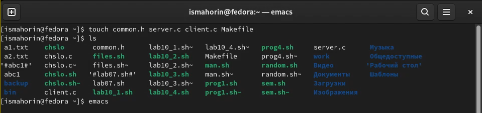
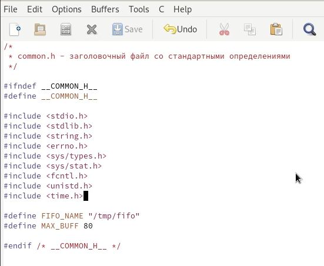
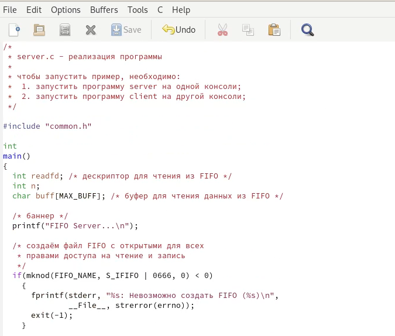
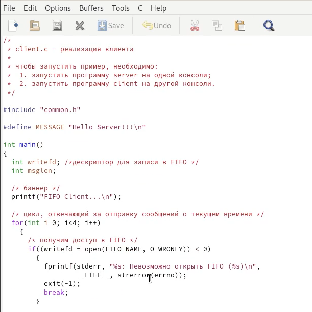
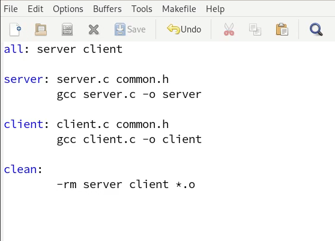
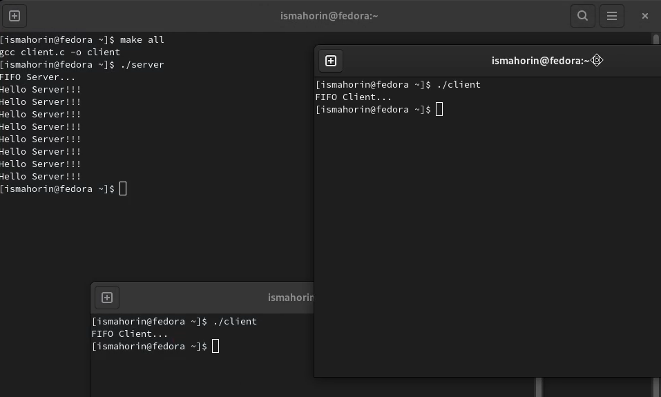

---
## Front matter
lang: ru-RU
title: Лабораторная работа № 14.
author: |
	Махорин Иван Сергеевич
institute: |
	RUDN, Москва, Россия
date: 2022, 2 июня

## Formatting
toc: false
slide_level: 2
theme: metropolis
header-includes: 
 - \metroset{progressbar=frametitle,sectionpage=progressbar,numbering=fraction}
 - '\makeatletter'
 - '\beamer@ignorenonframefalse'
 - '\makeatother'
aspectratio: 43
section-titles: true
---

# Именованные каналы

## Создание файлов и переход в emacs

{ #fig:001 width=100% }

## Первый скрипт

{ #fig:002 width=70% }

## Второй скрипт

{ #fig:003 width=70% }

## Третий скрипт

{ #fig:004 width=70% }

## Четвёртый скрипт

{ #fig:005 width=70% }

## Проверка выполнения

{ #fig:006 width=100% }

# Выводы

В ходе выполнения лабораторной работы были приобретены практические навыки работы с именованными каналами.

## {.standout}

Спасибо за внимание!
