---
## Front matter
lang: ru-RU
title: Первый этап индивидуального проекта.
author: |
	Махорин Иван Сергеевич
institute: |
	RUDN, Москва, Россия
date: 2022, 29 апреля

## Formatting
toc: false
slide_level: 2
theme: metropolis
header-includes: 
 - \metroset{progressbar=frametitle,sectionpage=progressbar,numbering=fraction}
 - '\makeatletter'
 - '\beamer@ignorenonframefalse'
 - '\makeatother'
aspectratio: 43
section-titles: true
---

# Выполнение первого этапа индивидуального проекта

## Исполняемый файл "hugo"

Сайт: https://github.com/gohugoio/hugo/releases

Архив: hugo_extended_0.98.0_Linux-64bit.tar.gz

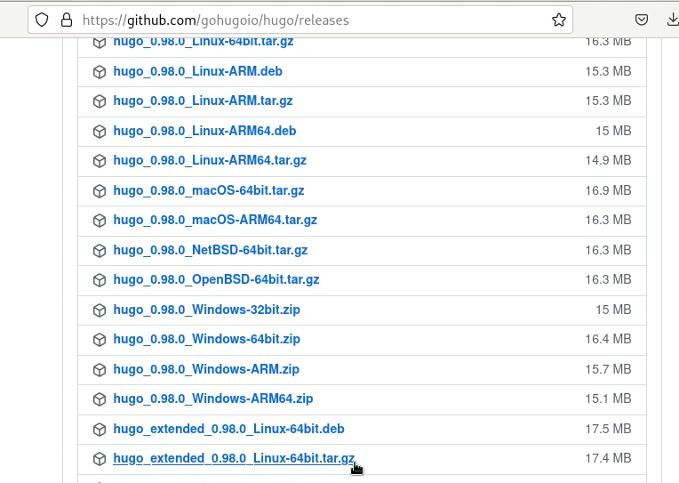{ #fig:001 width=70% }

## Разархивация

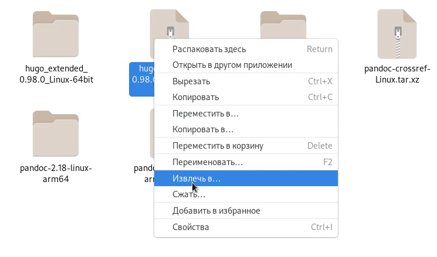{ #fig:002 width=70% }

## Каталог "bin" и файл "hugo"

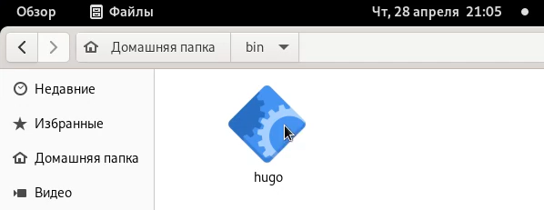{ #fig:003 width=70% }

1. Создаём каталог "bin" в домашнем каталоге
2. Копируем файл "hugo" в каталог "bin"

## Создание нового репозитория "blog"

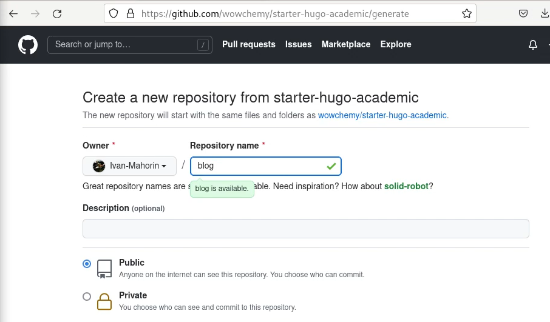{ #fig:004 width=70% }

## Клонирование

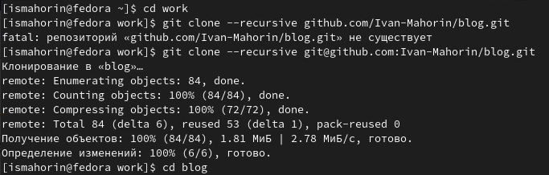{ #fig:005 width=100% }

1. В терминале переходим в каталог "work"
2. Клонируем репозиторий
3. Переходим в новый каталог "blog"

## Установка "go"

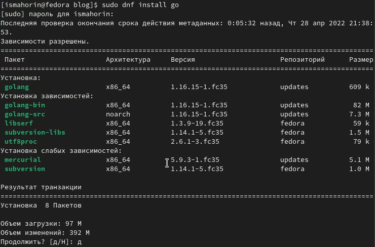{ #fig:006 width=70% }

sudo dnf install go

## "~/bin/hugo"

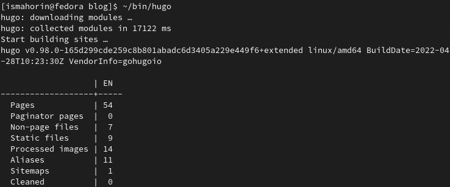{ #fig:007 width=100% }

## Удаление каталога "public"

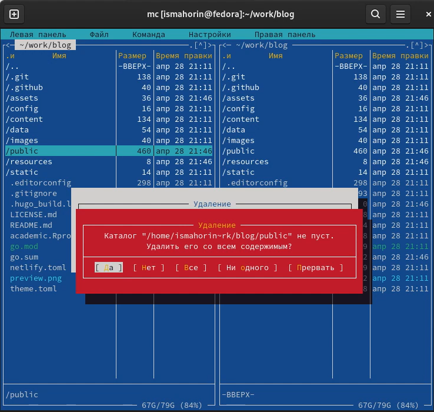{ #fig:008 width=70% }

## Ссылка на локальный сайт

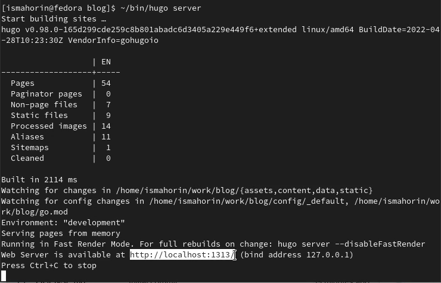{ #fig:009 width=70% }

## Переход на локальный сайт

{ #fig:010 width=70% }

## Предупреждение на сайте

1. Выполняем путь в домашнем каталоге: "work", "blog", "content", "home"
2. Удаляем файл "demo.md"

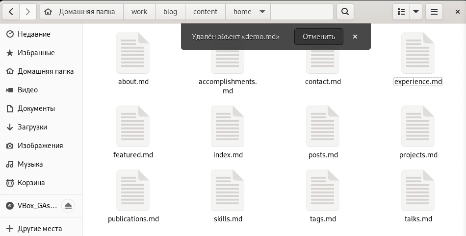{ #fig:011 width=70% }

## Создание репозитория со специальным названием

Специальное название: Ivan-Mahorin.github.io

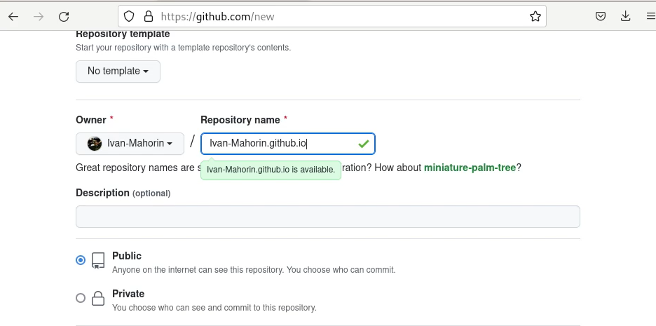{ #fig:012 width=100% }

## Клонирование репозитория

1. Возвращаемся в терминал и переходим в каталог "work"
2. Клонируем наш репозиторий
3. Выполняем проверку командой: "ls -l"

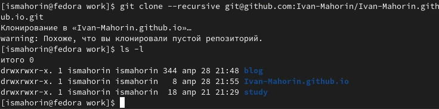{ #fig:013 width=70% }

## Создание пустого файла для активации репозитория

1. Переходим в новый каталог и переключаемся на ветку "main"
2. Создаём пустой файл и отправляем его на github

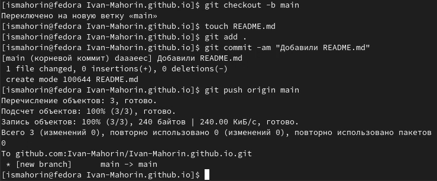{ #fig:014 width=100% }

## Попытка подключения каталога к новому репозиторию

1. Переходим в каталог "blog"
2. Выполняем команду для подключения

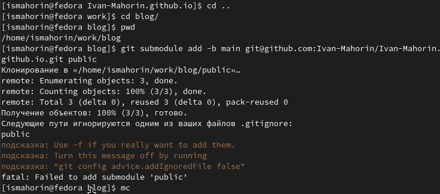{ #fig:015 width=100% }

## Комментирование "public"

1. Запускаем команду "mc" и переходим в ".gitignore"
2. Комментируем "public"

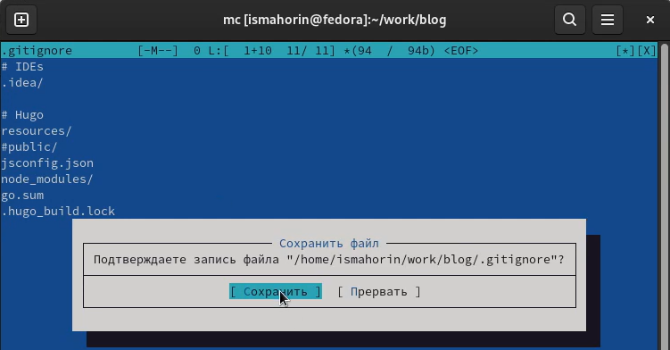{ #fig:016 width=70% }

## Выполнение проверки и повторное подключение

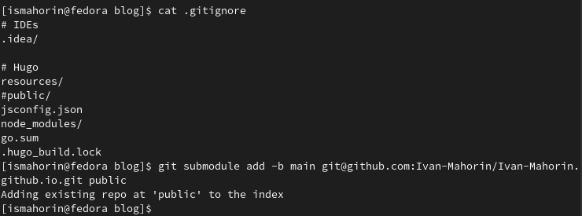{ #fig:017 width=100% }

## Автоматическая генерация файлов 

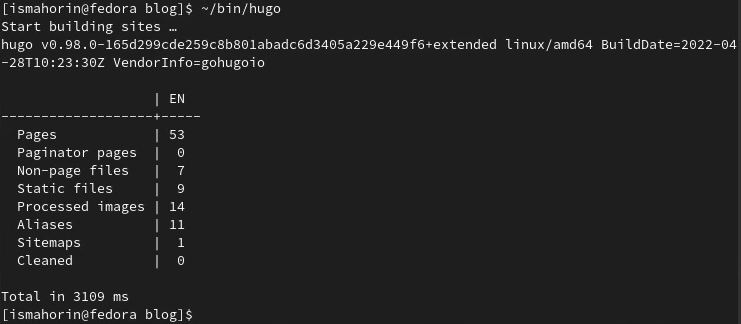{ #fig:018 width=100% }

## Синхронизация файлов из каталога "public" с репозиторием

1. Переходим в каталог "public"
2. Провераем подключение этого каталога к репозиторию
3. Выгружаем файлы в наш репозиторий

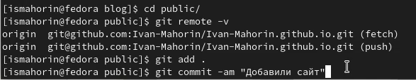{ #fig:019 width=100% }

## Обновление страницы репозитория на github

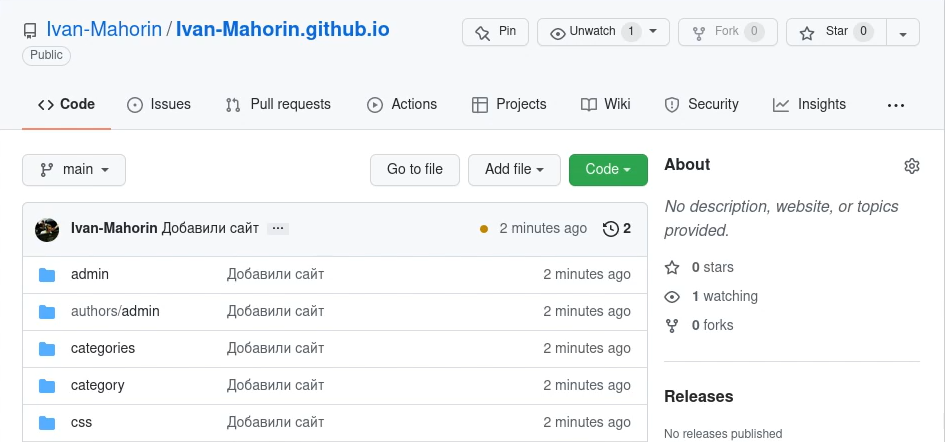{ #fig:020 width=100% }

## Новый сайт

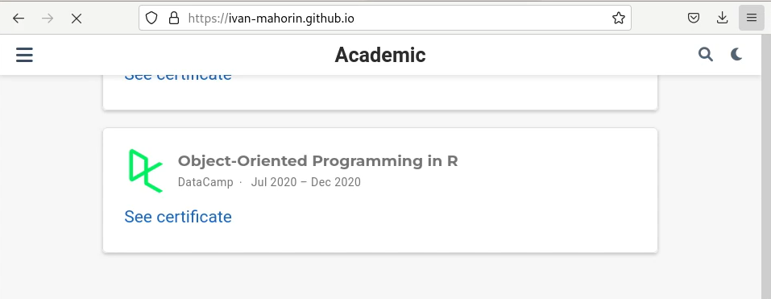{ #fig:021 width=100% }

# Выводы

В ходе выполнения первого этапа индивидуального проекта мы научились размещать на Github pages заготовки для персонального сайта.

## {.standout}

Спасибо за внимание!
