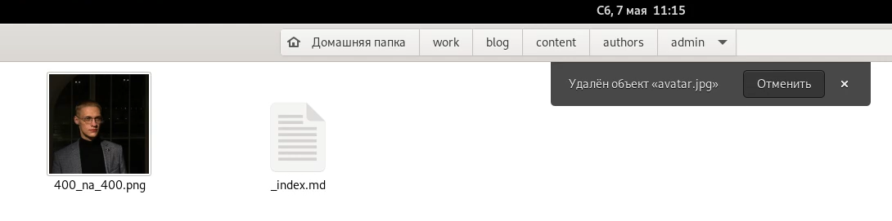
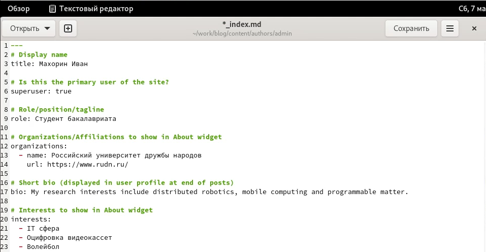
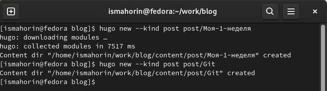
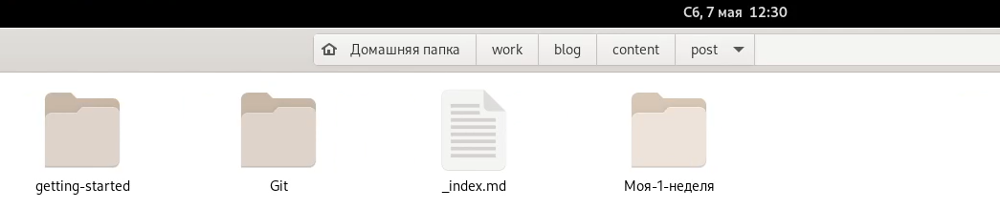
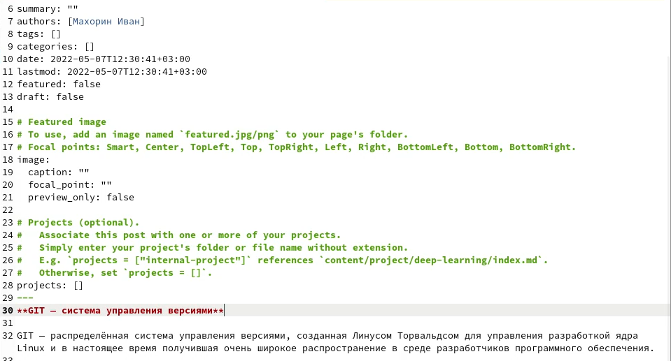
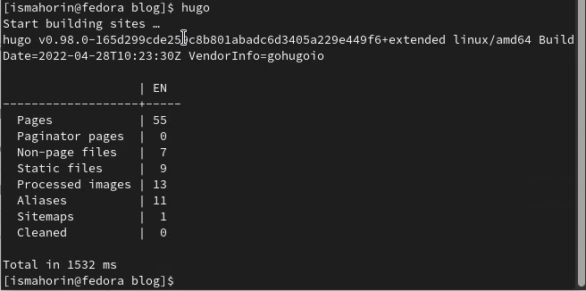
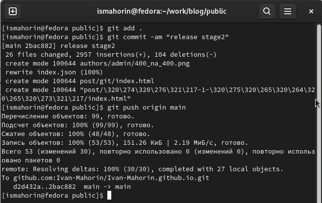
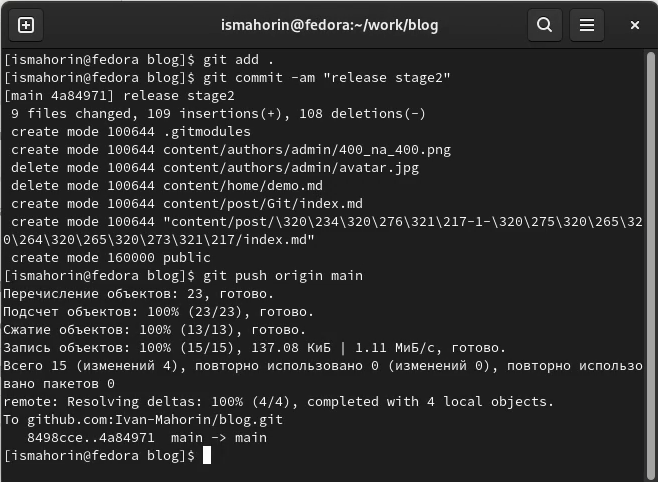
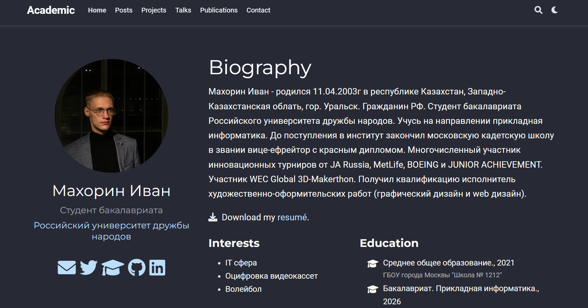
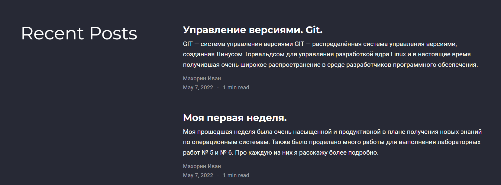

---
## Front matter
lang: ru-RU
title: Второй этап индивидуального проекта.
author: |
	Махорин Иван Сергеевич
institute: |
	RUDN, Москва, Россия
date: 2022, 7 мая

## Formatting
toc: false
slide_level: 2
theme: metropolis
header-includes: 
 - \metroset{progressbar=frametitle,sectionpage=progressbar,numbering=fraction}
 - '\makeatletter'
 - '\beamer@ignorenonframefalse'
 - '\makeatother'
aspectratio: 43
section-titles: true
---

# Выполнение второго этапа индивидуального проекта

## Добавление фотографии на сайт

Путь к фотографии: "work", "blog", "content", "authors", "admin".

{ #fig:001 width=100% }

## Добавление информации о себе

{ #fig:002 width=100% }

## Создание постов

Каталог "blog". Команда: hugo new --kind post post/(название поста).

{ #fig:003 width=100% }

## Проверка создания постов

{ #fig:004 width=100% }

## Внесение информации для поста

{ #fig:005 width=100% }

## Запуск команды hugo

{ #fig:006 width=100% }

## Выгрузка на github

{ #fig:008 width=100% }

## Выгрузка на github
	
{ #fig:007 width=70% }

## Просмотр изменений на сайте

{ #fig:009 width=100% }

## Просмотр изменений на сайте

{ #fig:010 width=100% }

# Выводы

В ходе выполнения второго этапа индивидуального проекта мы научились добавлять к сайту информацию о себе, а также создавать новые посты.

## {.standout}

Спасибо за внимание!
