---
## Front matter
lang: ru-RU
title: Третий этап индивидуального проекта.
author: |
	Махорин Иван Сергеевич
institute: |
	RUDN, Москва, Россия
date: 2022, 12 мая

## Formatting
toc: false
slide_level: 2
theme: metropolis
header-includes: 
 - \metroset{progressbar=frametitle,sectionpage=progressbar,numbering=fraction}
 - '\makeatletter'
 - '\beamer@ignorenonframefalse'
 - '\makeatother'
aspectratio: 43
section-titles: true
---

# Выполнение третьего этапа индивидуального проекта

## Добавление навыков на сайт

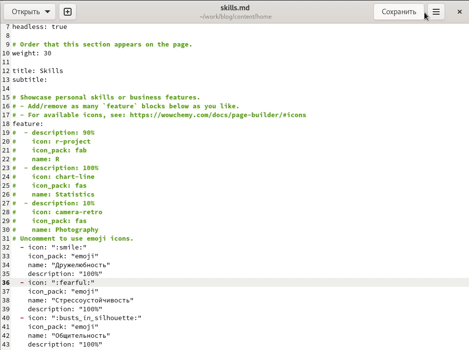{ #fig:001 width=80% }

## Добавление логотипа

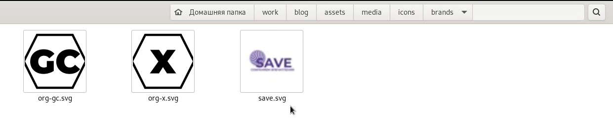{ #fig:002 width=100% }

## Добавление опыта на сайт

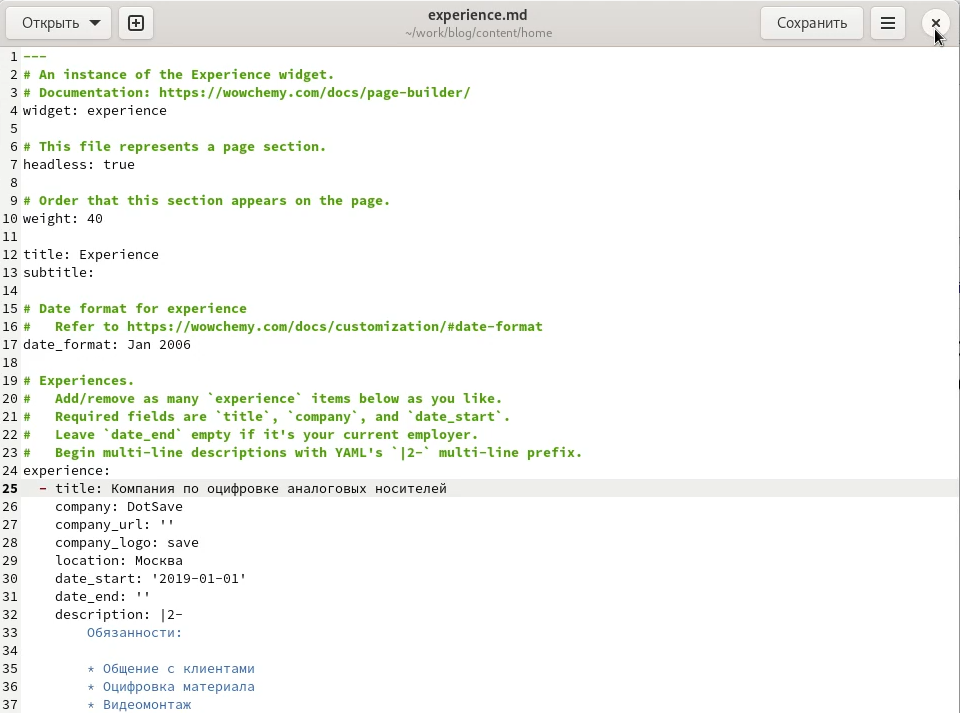{ #fig:003 width=80% }

## Добавление достижений на сайт

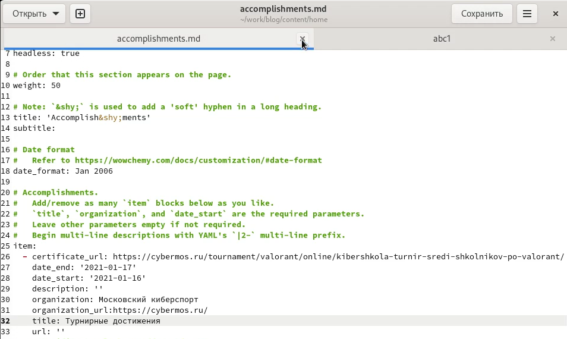{ #fig:004 width=100% }

## Создание постов

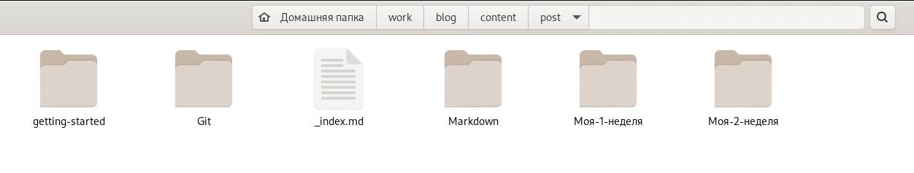{ #fig:005 width=100% }

## hugo

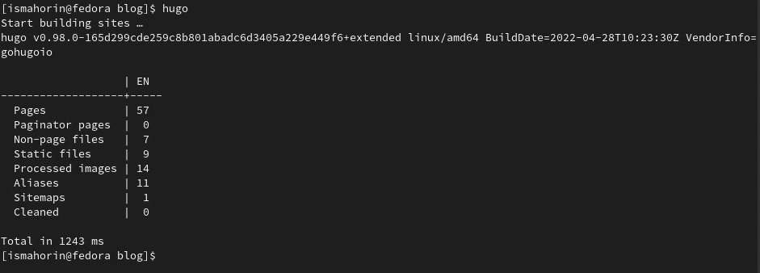{ #fig:006 width=100% }

## Выгрузка из подкаталога "public"

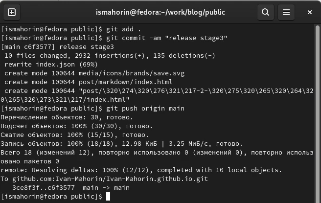{ #fig:007 width=80% }

## Выгрузка из каталога "blog"

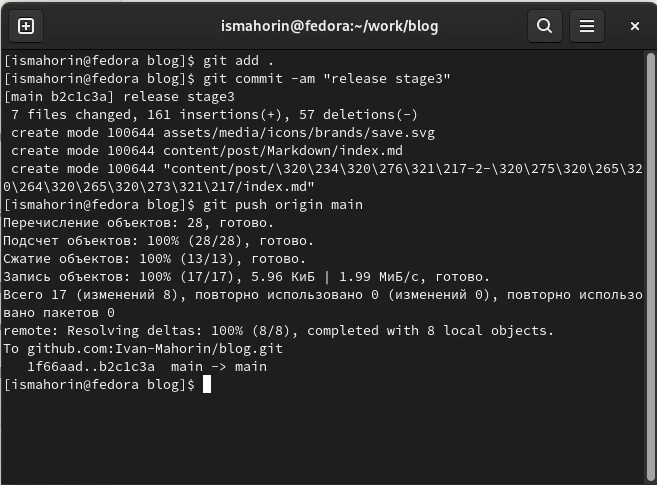{ #fig:008 width=80% }

## Внешний вид обновлённого сайта

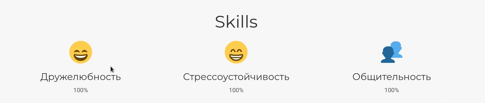{ #fig:009 width=100% }

## Внешний вид обновлённого сайта

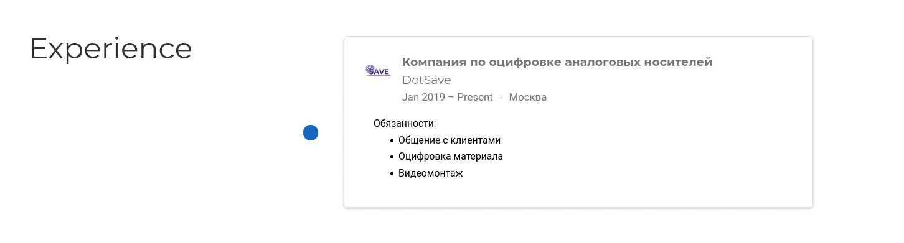{ #fig:010 width=100% }

## Внешний вид обновлённого сайта

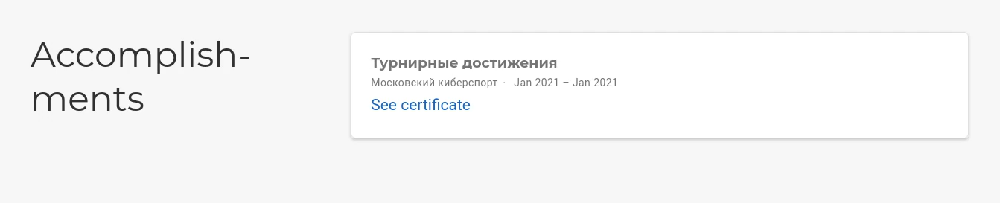{ #fig:011 width=100% }

## Внешний вид обновлённого сайта

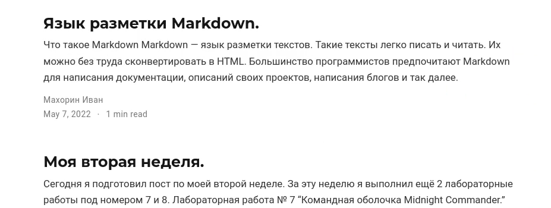{ #fig:012 width=100% }

# Выводы

В ходе выполнения третьего этапа индивидуального проекта мы научились добавлять к сайту достижения.

## {.standout}

Спасибо за внимание!
